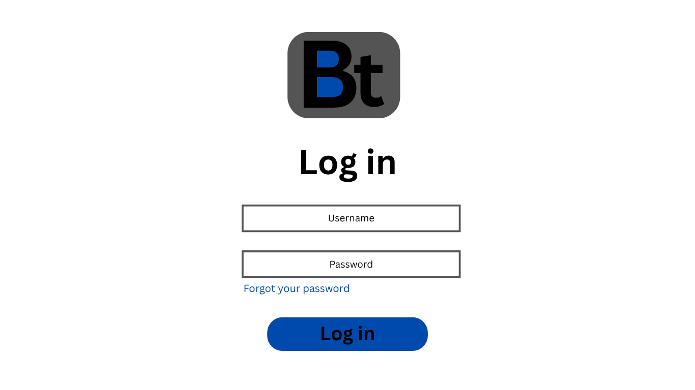

# IT340-Bookit

## *1. Project Details:*

### *📌Project Name:*
BookIt
  
### *📌Type of Website/Service* (e.g., e-commerce site, blog, portfolio, internal company dashboard, etc.)
Appointment Booking & Scheduling Platform

### *📌Purpose of the Website/Service*
What problem does it solve or what value does it provide?
BookIt is a website that allows users to easily schedule appointments with hairstylists, tattoo artists, nail technicians, and other personal care professionals. There will be two different roles, service provider and client, each will have their dedicated dashboard. Clients will view available time slots, book services in advance, and receive appointment reminders. Service providers will use the dashboard to manage their schedules, update service offerings, and avoid double bookings. The goal of BookIt is to save time, reduce scheduling conflicts, and create a smoother booking experience for both clients and service providers.

### *📌Image or Drawing of a Login Page* (Can be hand-drawn, digitally created, or AI-generated.)

## *2. Deliverables:*
#### 1. Log in page: Users log in with different roles
- Service providers 
- Clients
#### 2. Authentication: Password hash and encryption, and email verification
#### Homepage: 
- Recommended services on top
- Search up bar to look for service provider
- Feature to showcase service providers near you
#### Dashboard (based on the user):
- Service providers: Manage their schedules, update service offerings, and avoid double bookings.
- Clients: View available time slots, book services in advance, and receive appointment reminders.
#### Database: Once you click on an appointment page, the data should be stored in the database in a cart system 
- Cancellation System: Reschedule page with amount of hours ( you can’t cancel within 2 hours)
- Extra credit: Online chat between client and service provider (only as signed in user, saved chat)

## *3. Deliverable 1 (Due: November 13):*

#### Log in page (no back-end) : Users log in with different roles
- Service providers 
- Clients
#### Homepage: 
- Recommended services on top
- Search up bar to look for service provider
- Feature to showcase service providers near you
#### Dashboard (based on the user):
- Service providers: Manage their schedules, update service offerings, and avoid double bookings.
- Clients: View available time slots, book services in advance, and receive appointment reminders.
